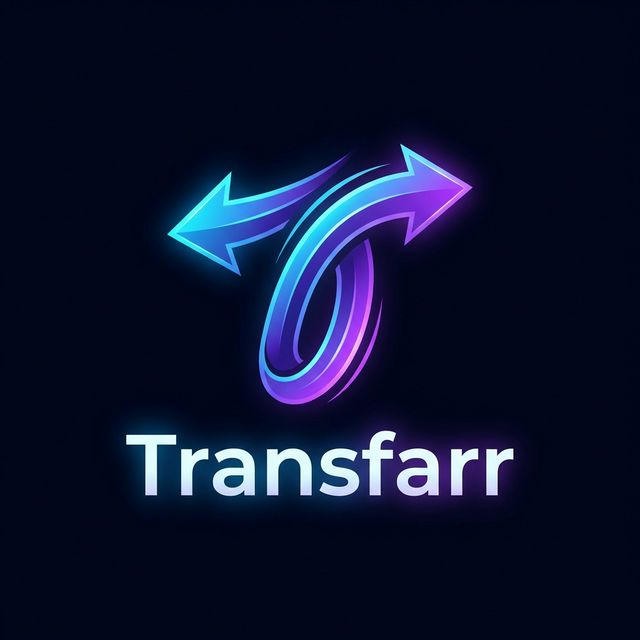

<p align="center">
  
</p>

<p align="center">
  <a href="https://github.com/at-besa/Transfarr/actions/workflows/docker-publish.yml">
    
  </a>
  
  
  
</p>

# Transfarr P2P

Transfarr is a modern, decentralized peer-to-peer (P2P) file-sharing application built on .NET and SignalR. It enables users to discover peers, share directories, and perform high-speed direct transfers through a unified web interface. 

The project is designed with a "Shared Core" architecture, allowing the same UI and business logic to be hosted across multiple platforms, including WebAssembly and potentially future desktop or mobile shells.

## Core Features

- **TTH Swarm Fetching:** Download files from multiple peers simultaneously to maximize your bandwidth. The node automatically discovers new sources for your queue.
- **Robust Resuming:** Interrupted downloads? No problem. Transfarr uses bitfield-based segment tracking (20MB chunks) to resume exactly where it left off.
- **Persistent Download Queues:** Automatic restoration of pending transfers across daemon restarts.
- **Signaling Hub Reconnection:** Automatic connection management and retry logic for the global discovery network.
- **Configurable Node Identity:** Dynamic management of node display names and connectivity settings via a centralized Settings interface.
- **Advanced Connectivity:** Direct TCP-based P2P transfers with configurable ports.
- **Modern UI:** High-performance, obsidian-themed interface with integrated global chat and real-time monitoring.

## Getting Started

### Using Docker (Recommended)

The easiest way to run Transfarr is via Docker:

```bash
docker run -d \
  --name transfarr \
  -p 5150:5150 \
  -p 5151:5151 \
  -v transfarr-data:/app/data \
  -v /path/to/downloads:/app/downloads \
  atbesa/transfarr-node:latest
```

### Manual Installation

#### Prerequisites
- .NET 10.0 SDK or later.

#### 1. Running the Signaling Hub
To enable node discovery, first start the signaling service:
```bash
cd Transfarr.Signaling
dotnet run
```
By default, the signaling hub listens on `http://localhost:5135/signaling`.

#### 2. Running a Transfarr Node
After the signaling hub is operational, start your local node:
```bash
cd Transfarr.Node
dotnet run
```
The node will launch its web interface at `http://localhost:5150`.

## Project Structure

- **Transfarr.Signaling:** The central hub service used for node discovery, peer-to-peer signalling, and global chat message relay.
- **Transfarr.Node:** The local daemon that handles the actual P2P file transfers and hosts the Blazor-based user interface.
- **Transfarr.Client.Core:** A Razor Class Library containing the entire application logic, UI components, and state management.
- **Transfarr.Client.Web:** The Blazor WebAssembly host that runs the application in the browser.
- **Transfarr.Shared:** Common models, contracts, and utility classes shared across all components.

## License

This project is licensed under the GNU General Public License v3.0 (GPLv3). See the [LICENSE](LICENSE) file for the full text.
